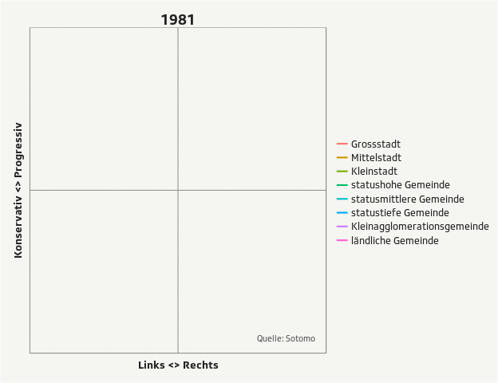

## Notes

This document illustrates the preprocessing of the dataset visualized in this [article on srf.ch](http://www.srf.ch/news/wahlen/wahlkampf/stadt-und-land-sind-politisch-in-festen-haenden).

SRF Data attaches great importance to transparent and reproducible data preprocessing and -analysis. SRF Data believes in the principles of open data but also open and reproducible methods. Third parties should be empowered to build on the work of SRF Data and to generate new analyses and applications. 

### R-Script & processed data

The preprocessing and analysis of the data was conducted in the [R project for statistical computing](https://www.r-project.org/). The RMarkdown script used to generate this document and all the resulting data can be downloaded [under this link](http://srfdata.github.io/2015-09-elections-political-shifts/rscript.zip). Through executing `main.Rmd`, the herein described process can be reproduced and this document can be generated. In the course of this, data from the folder `ìnput` will be processed and results will be written to `output`. 

### GitHub

The code for the herein described process can also be freely downloaded from [https://github.com/srfdata/2015-09-elections-political-shifts](https://github.com/srfdata/2015-09-elections-political-shifts). Criticism in the form of GitHub issues and pull requests is very welcome! 

### License

<a rel="license" href="http://creativecommons.org/licenses/by-nc-sa/4.0/"></a><br /><span xmlns:dct="http://purl.org/dc/terms/" property="dct:title">2015-09-elections-political-shifts</span> by <a xmlns:cc="http://creativecommons.org/ns#" href="https://github.com/srfdata/2015-09-elections-political-shifts" property="cc:attributionName" rel="cc:attributionURL">SRF Data</a> is licensed under a <a rel="license" href="http://creativecommons.org/licenses/by-nc-sa/4.0/">Creative Commons Attribution-NonCommercial-ShareAlike 4.0 International License</a>.

### Exclusion of liability

The published information has been collated carefully, but no guarantee is offered of its completeness, correctness or up-to-date nature. No liability is accepted for damage or loss incurred from the use of this script or the information drawn from it. This exclusion of liability also applies to third-party content that is accessible via this offer.

### Other projects

All code & data from [SRF Data](http://srf.ch/data) is available under [http://srfdata.github.io](http://srfdata.github.io).

## Data description

### Original data source

Michael Hermann, Mario Nowak (Forschungsstelle sotomo) with data from the Swiss Federal Statistical Office (FSO). 

#### Shifts in political space

The shifts on the left-right- and the progressive-conservative-axes are available *from 1981 to 2014 (1-year-steps)* in the spatial aggregation levels of:

* municipalities (`gem`)
* cantons (`kt`)
* municipality types ([detailed description](http://www.srfcdn.ch/elections15/assets/gemeindetypologie_sotomo.pdf)) (`agglotyp`)
* language regions (`sprachreg`)

They are computed from national ballots results using a statistical dimensionality reduction method. A detailed methodology description (in German) can be found in the box at the end of the [article on srf.ch](http://www.srf.ch/news/wahlen/wahlkampf/stadt-und-land-sind-politisch-in-festen-haenden). Important: The dimensionless values always signify the relative deviation from the median in a given year -> not absolute, semantical positions. 

#### Shifts in party strengths

The shifts in party strengths for the *national council* are available *from 1971 to 2014 (4-year-steps)* in the spatial aggregation levels of:

* municipalities (`gem`)
* cantons (`kt`)
* municipality types ([detailed description](http://www.srfcdn.ch/elections15/assets/gemeindetypologie_sotomo.pdf)) (`agglotyp`)
* language regions (`sprachreg`)

#### Spatial aggregation & municipality harmonization

For all computations and spatial aggregations, the municipalities of 2015 were used ("Gemeindestand"). In order to account for municipality mergers and splits, the data were fully harmonized to the level of 2015. 

### Description of output

The following sections describe the results of the data preprocessing as stored in the `output` folder. 

#### `output/polit_raum_*.csv`

Contains position on the left-right- and the progressive-conservative-axes *from 1981 to 2014 (1-year-steps)* in the above mentioned spatial aggregation levels.

| Attribute | Type | Description | 
|-------|------|---------|
| jahr | Integer  | Year  |
|  `*_id`  |  Integer / String | ID of the referenced spatial unit |
|  dim  |  Integer | Political space dimension (axis). Dimension 21 signifies left (negative) and right (positive), 22 signifies progressive (positive) and conservative (negative).   |
|  wert  |  Double |  Value (dimensionless). See explanation above. |
|  anz_gultig  |  Double |  Number of people who voted validly in a given year and spatial unit (yearly average, rounded). |
|  anz_stber  |  Double |  Total number of people allowed to vote in a given year and spatial unit (yearly average, rounded). |

#### `output/nrw_*.csv`

Contains party strengths in percent for the *national council from 1971 to 2014 (4-year-steps)* in the above mentioned spatial aggregation levels.

| Attribute | Type | Description | 
|-------|------|---------|
| jahr | Integer  | Year of national council election  |
|  `*_id`  |  Integer / String | ID of the referenced spatial unit |
|  partei  |  Integer | Party ID, references ID in `output/parties.csv`  |
|  wert  |  Double |  Party strength in percent  |


### Lookup tables 

#### `output/lut_*.csv`

Contains full names and further information (e.g. translations) for the spatial aggregation levels of municipalities (`gem`) and municipality types (`agglotyp`). 

Goes without description.

#### `output/parties.csv`

Contains party classifications made by SRF Data with the help of political scientists, used throughout all projects related to elections.

| Attribute | Type | Description | 
|-------|------|---------|
| ID | Integer  | Unique identifier  |
|  Abbr_*  |  String |  Abbreviation in German (D), French (F), English (E), Romansh (R), Italian (I), respectively  |
|  Legend_*  |  String |  Abbreviation, but with slightly more information, used for frontend purposes  |
|  Name_*  |  String |  Full name  |
|  Sortorder  |  Integer | Used for frontend purposes solely |
|  OLD_ID  |  String | "Official" ID as given in https://github.com/srfdata/2015-06-elections-partystrengths/blob/master/analysis/input/parteienstaerke_mod_2.xlsx (sheet "Parteien"), used for combining party strengths for party groupings  |

## Preparations

### Install packages

```{r, echo=FALSE, warning=FALSE, message=FALSE}

knitr::opts_chunk$set(fig.width=12, fig.height=8,  warning=FALSE)

options(scipen = 10)
# load necessary packages
if(!require(dplyr)) {
  install.packages("dplyr", repos="http://cran.us.r-project.org")
  require(dplyr)
}
if(!require(tidyr)) {
  install.packages("tidyr", repos="http://cran.us.r-project.org")
  require(tidyr)
}
if(!require(ggplot2)) {
  install.packages("ggplot2", repos="http://cran.us.r-project.org")
  require(ggplot2)
}
if(!require(magrittr)) {
  install.packages("magrittr", repos="http://cran.us.r-project.org")
  require(magrittr)
}
if(!require(readxl)) {
  devtools::install_github("hadley/readxl")
  require(readxl)
}
if(!require(jsonlite)) {
  install.packages("jsonlite", repos="http://cran.us.r-project.org")
  require(jsonlite)
}

if(!require(animation)) {
  install.packages("animation", repos="http://cran.us.r-project.org")
  require(animation)
}

if(!require(extrafont)) {
  install.packages("extrafont", repos="http://cran.us.r-project.org")
  require(extrafont)
}

library(scales)
# font_import()
```

Read in data & prepare it

```{r}
# We mostly need the following datasets

# lut_agglotyp.csv
lut_agglotyp <- read.csv2(file = "input/lut_agglotyp.csv", sep = ";", stringsAsFactors = F)

# polit_raum_agglotyp.csv
polit_raum_agglotyp <- read.csv2(file = "input/polit_raum_agglotyp.csv", sep = ";", stringsAsFactors = F)

# anz_gultig_agglotyp.csv
anz_gultig_agglotyp <- read.csv2(file = "input/anz_gultig_agglotyp.csv", sep = ";", stringsAsFactors = F)

# anz_stber_agglotyp.csv
anz_stber_agglotyp <- read.csv2(file = "input/anz_stber_agglotyp.csv", sep = ";", stringsAsFactors = F)

# add valid votes
polit_raum_agglotyp %<>%
  inner_join(anz_gultig_agglotyp, by = c("jahr", "agglotyp")) %>% 
  rename(anz_gultig = anz) %>%
  inner_join(anz_stber_agglotyp, by = c("jahr", "agglotyp")) %>% 
  rename(anz_stber = anz) %>% 
  mutate(share_vote = anz_gultig / anz_stber)

polit_raum_agglotyp %<>% 
  mutate(wert = as.numeric(wert), agglotyp = factor(agglotyp, levels = lut_agglotyp$typ_id, labels = lut_agglotyp$typ)) 
polit_raum_agglotyp_left_right <- polit_raum_agglotyp %>% 
  filter(dim == 22)
polit_raum_agglotyp_cons_prog <- polit_raum_agglotyp %>% 
  filter(dim == 21) 

# lut_gem.csv
lut_gem <- read.csv2(file = "input/lut_gem.csv", sep = ";", stringsAsFactors = F)

# polit_raum_gem.csv
polit_raum_gem <- read.csv2(file = "input/polit_raum_gem.csv", sep = ";", stringsAsFactors = F)

polit_raum_gem %<>% 
  mutate(wert = as.numeric(wert)) 

# join in agglotyp
polit_raum_gem %<>% 
  inner_join(lut_gem, by = "gnr") %>% 
  mutate(agglotyp_id = factor(agglotyp_id, levels = lut_agglotyp$typ_id, labels = lut_agglotyp$typ)) %>% 
  select(-agglotyp) %>% 
  rename(agglotyp = agglotyp_id)

# join in agglotyp values
polit_raum_gem %<>%
  inner_join(polit_raum_agglotyp, by = c("jahr", "dim", "agglotyp")) %>% 
  select(-anz_gultig) %>% 
  rename(wert_gde = wert.x, wert_agglotyp = wert.y)

# polit_raum_sprachreg.csv
polit_raum_sprachreg <- read.csv2(file = "input/polit_raum_sprachreg.csv", sep = ";", stringsAsFactors = F)

# lut_sprachreg.csv
lut_sprachreg <- read.csv2(file = "input/lut_sprachreg.csv", sep = ";", stringsAsFactors = F)

# anz_gultig_sprachreg.csv
anz_gultig_sprachreg <- read.csv2(file = "input/anz_gultig_sprachreg.csv", sep = ";", stringsAsFactors = F)

# anz_stber_sprachreg.csv
anz_stber_sprachreg <- read.csv2(file = "input/anz_stber_sprachreg.csv", sep = ";", stringsAsFactors = F)

# add valid votes
polit_raum_sprachreg %<>%
  rename(jahr = Jahr) %>% 
  inner_join(anz_gultig_sprachreg, by = c("jahr", "sprachreg")) %>% 
  rename(anz_gultig = anz) %>% 
  inner_join(anz_stber_sprachreg, by = c("jahr", "sprachreg")) %>% 
  rename(anz_stber = anz) %>% 
  mutate(share_vote = anz_gultig / anz_stber)

polit_raum_sprachreg %<>% 
  mutate(wert = as.numeric(wert), sprachreg = factor(sprachreg, levels = lut_sprachreg$sprachreg, labels = lut_sprachreg$label_sprachreg)) 

# parties
nrw_agglotyp <- read.csv2(file = "input/nrw_71_agglotyp.csv", sep = ";", stringsAsFactors = F)
nrw_agglotyp %<>% 
  mutate(wert = as.numeric(wert), agglotyp = factor(agglotyp, levels = lut_agglotyp$typ_id, labels = lut_agglotyp$typ)) 


nrw_gem <- read.csv2(file = "input/nrw_71_gem.csv", sep = "\t", stringsAsFactors = F)

```

Plausibility checks

```{r, echo = TRUE, message = TRUE}
# correct number of rows?
nrow(polit_raum_agglotyp) == 34 * 8 * 2

nrow(polit_raum_gem) == 34 * 2324 * 2

length(unique(nrw_agglotyp$partei))
length(unique(nrw_agglotyp$jahr))
nrow(nrw_agglotyp) == 11 * 8 * 12 
```

## Analysis

### Group sizes

In the following analyses, it is important to note that different municipality types are home to a differing amount of people and are thus not equally "important" for the political landscape of Switzerland. 
The following chart gives an overview. 

```{r}
anz_stber <- anz_stber_agglotyp %>% 
  filter(jahr == 2014)
anz_stber %<>% 
  mutate(agglotyp = factor(agglotyp, levels = lut_agglotyp$typ_id, labels = lut_agglotyp$typ)) 
ggplot(anz_stber, aes(x = agglotyp, y = anz)) +
  geom_bar(stat = "identity") +
  ylab("Number of people allowed to vote") +
  xlab("Municipality type") +
  theme(axis.text.x = element_text(angle = 90))
```

### Progressive-conservative dimension

```{r}
# developments in the agglomeration types - dim cons/progr
ggplot(polit_raum_agglotyp_cons_prog, aes(x = jahr, y = wert, color = agglotyp, size = anz_gultig, alpha = anz_gultig)) +
    geom_line() +
    geom_hline(yintercept = 0) + 
    ylim(-10, 10) +
    ylab("Value (Positive: progressive; negative: conservative)") +
    xlab("Year") +
    ggtitle(label = "Political shifts on the progressive-conservative-axis") +
    guides(color = guide_legend(ncol = 2), alpha = F) +
    theme(legend.title = element_text()) +
    scale_color_discrete(name = "Type of municipality") +
    scale_size_continuous(name = "Number of valid votes, also conveyed with opacity")
```

#### Most important findings: 

* Big cities performed a significant and constant shift to being more progressive in the last 35 years, a shift which has slowed down in the last 10 years. 
* Municipalities with high status and with low status moved into the opposite direction, the latter starting further "down". The same is also the case for municipalities with middle status. Note: All these municipalities belong to agglomeration which is not part of the core of agglomerations (i.e. not the same as "cities" / typical "agglo" as we would call it)
* Most voters live in small agglomeration municipalities - these stayed mostly the same over the last 35 years.
* Rural municipalities performed a significant and relatively stark shift to being more progressive in the last 10 years.

### Left-right dimension

```{r}
# developments in the agglomeration types - dim left/right
ggplot(polit_raum_agglotyp_left_right, aes(x = jahr, y = wert, color = agglotyp, size = anz_gultig, alpha = anz_gultig)) +
    geom_line() +
    geom_hline(yintercept = 0) + 
    ylim(-10, 10) + 
    ylab("Value (Negative: left; positive: right)") +
    xlab("Year") +
    ggtitle(label = "Political shifts on the left-right-axis") +
    guides(color = guide_legend(ncol = 2), alpha = F) +
    theme(legend.title = element_text()) +
    scale_color_discrete(name = "Type of municipality") +
    scale_size_continuous(name = "Number of valid votes, also conveyed with opacity") +
    coord_flip()
```

#### Most important findings: 

* Big cities were already very "left", and even went further away into the left in the last 15 years.
* The time between approximately 1995 and 2005 can be considered to be more "harmonic" than before and after - the difference between the left and right were not so stark then. 
* Both small agglomeration municipalities and rural municipalities considerably shifted to the right in the last 10 year - but not nearly as strong as big cities moved to the left. 
* Municipalities of high and middle status both shifted slightly to the left in the last 10 years, the former being more right wing than the latter. 
* Another relatively strong shift could be observed in low-status-municipalities, but it happened already in the early 90es. During that time, also higher status municipalities considerably shifted to the right. 

### Both together

```{r}
# need to spread it first
polit_raum_agglotyp_spread <- polit_raum_agglotyp %>% 
  spread(dim, wert) %>% 
  rename(leftright = `22`, progcons = `21`)

library(grid)

# note: we use geom_path here instead of geom_line 
ggplot(polit_raum_agglotyp_spread, aes(x = leftright, y = progcons, color = agglotyp)) +
    geom_path(arrow = arrow(ends = "last", type = "closed", length = unit(0.13, "inches"))) +
    geom_hline(yintercept = 0) + 
    geom_vline(xintercept = 0) + 
    xlab("Value (Negative: left; positive: right)") +
    ylab("Value (Positive: progressive; negative: conservative)") +
    ggtitle(label = "Political shifts on both axes") +
    guides(color = guide_legend(ncol = 2)) +
    theme(legend.title = element_text(size = 14), axis.text.x = element_blank(), axis.text.y = element_blank(), axis.ticks.x = element_blank(), axis.ticks.y = element_blank(), plot.margin = unit(c(1,1,1,1), "lines"), legend.text = element_text(size = 14), legend.box = "vertical") +
    guides(color = guide_legend(ncol = 1)) + 
    scale_color_discrete(name = "Type of municipality") +
    scale_alpha_continuous(name = "Year") +
    xlim(-10, 10) +
    ylim(-10, 10)
```

#### Most important findings: 

* The plot clearly shows one thing: Different municipality types occupy different "areas" in socio-political space. Only between small cities and municipalities of low and middle status the distinction is not that clear. 
    * Big cities: Progressive-left (tendency becoming stronger)
    * Middle cities: Progressive-left, although less strong
    * High-status-municipalities: Progressive-right
    * Rural municipalities: Conservative-right
    * Small agglomeration municipalities: Conservative-right, less pronounced than the above though
* The plot also shows in terms of big shifts: Big cities, low-status-municipalities, high-status-municipalities and rural municipalities have "wandered" the most, in more or less that order
* The plot also shows in terms of abrupt shifts: Small cities, small agglomeration municipalities, rural municipalities have made the "sharpest turns" recently - mostly to the right

### Exemplary municipalities

The following shows the three most similar (i.e. typical) municipalities for each of the municipality types (in terms of euclidean distance to both dimensions).
```{r}
polit_raum_gem %>% 
  group_by(gnr, gemeinde, agglotyp) %>% 
  summarize(euclidean = as.numeric(dist(rbind(wert_gde, wert_agglotyp)))) %>% 
  ungroup() %>% 
  group_by(agglotyp) %>% 
  arrange(euclidean) %>% 
  slice(1:3) %>% 
  as.data.frame()

# doublecheck
gnr_1 <- polit_raum_gem %>% 
  filter(gnr == 1) %>% 
  select(wert_gde, wert_agglotyp) %>% 
  as.data.frame()

dist(rbind(gnr_1$wert_gde, gnr_1$wert_agglotyp))

gnr_2861 <- polit_raum_gem %>% 
  filter(gnr == 2861) %>% 
  select(wert_gde, wert_agglotyp) %>% 
  as.data.frame()

dist(rbind(gnr_2861$wert_gde, gnr_2861$wert_agglotyp))
# seems to work ok

# plot them
most_similar_gnr <- polit_raum_gem %>% 
  group_by(gnr, gemeinde, agglotyp) %>% 
  summarize(euclidean = as.numeric(dist(rbind(wert_gde, wert_agglotyp)))) %>% 
  ungroup() %>% 
  group_by(agglotyp) %>% 
  arrange(euclidean) %>% 
  slice(1) %>% 
  ungroup() %>% 
  select(gnr)

most_similar <- polit_raum_gem %>% 
  filter(gnr %in% most_similar_gnr$gnr) %>% 
  select(jahr, gemeinde, dim, wert_gde, agglotyp) %>% 
  spread(dim, wert_gde) %>% 
  rename(leftright = `22`, progcons = `21`) %>% 
  arrange(jahr, agglotyp)

ggplot(most_similar, aes(x = leftright, y = progcons, color = agglotyp)) +
    geom_path(arrow = arrow(ends = "last", type = "closed", length = unit(0.13, "inches"))) +
    geom_hline(yintercept = 0) + 
    geom_vline(xintercept = 0) + 
    xlab("Value (Negative: left; positive: right)") +
    ylab("Value (Positive: progressive; negative: conservative)") +
    ggtitle(label = "Political shifts on both axes for most typical municipalities") +
    guides(color = guide_legend(ncol = 2)) +
    theme(legend.title = element_text()) +
    scale_color_discrete(name = "Type of municipality (colors identical with the plot above)") +
    scale_alpha_continuous(name = "Year") +
    xlim(-10, 10) +
    ylim(-10, 10)
```

### Voting participation

#### All values
```{r}
ggplot(polit_raum_agglotyp, aes(x = jahr, y = share_vote, color = agglotyp, alpha = anz_gultig)) +
    geom_line(size = 2) + 
    ylab("Average share of people who voted") +
    xlab("Year") +
    ggtitle(label = "Voting participation") +
    # scale_color_manual(values = distinct_colors) +
    guides(color = guide_legend(ncol = 2)) +
    theme(legend.title = element_text()) +
    scale_color_discrete(name = "Type of municipality") +
    scale_alpha_continuous(name = "Number of valid votes") +
    scale_y_continuous(labels = percent)
```
Note: The stark peak in 1989 is most likely due to the fact that, in this year, only one vote was used.

### Smoothed

```{r}
ggplot(polit_raum_agglotyp, aes(x = jahr, y = share_vote, color = agglotyp, alpha = anz_gultig)) +
    geom_line(aes(alpha = anz_gultig), stat = "smooth", se = F, method = "loess", size = 2) + 
    ylab("Average share of people who voted") +
    xlab("Year") +
    ggtitle(label = "Voting participation (loess smoother)") +
    guides(color = guide_legend(ncol = 2)) +
    theme(legend.title = element_text()) +
    scale_color_discrete(name = "Type of municipality") +
    scale_alpha_continuous(name = "Number of valid votes") +
    scale_y_continuous(labels = percent)
```

#### Most important findings:

* Generally, voting participation is increasing in the last decade.
* It also seems that municipality types used to be more "coherent" in terms of voting participation than nowadays. 
* Nowadays, i.e. in the last 10-15 years, differences in voting behavior can be observed:
    * Municipalities of high status seem to have a considerably higher voting participation than those of low status (in 2014, the former had almost 60%, the latter less than 50%)
    * Participation in urban areas seems to be higher than in rural areas.
    * These patterns seem to be consistent throughout time.
    
    
### Language regions 

```{r}
# need to spread it first
polit_raum_sprachreg_spread <- polit_raum_sprachreg %>% 
  spread(dim, wert) %>% 
  rename(leftright = `22`, progcons = `21`) 

# note: we use geom_path here instead of geom_line 
ggplot(polit_raum_sprachreg_spread, aes(x = leftright, y = progcons, color = sprachreg)) +
    geom_path(arrow = arrow(ends = "last", type = "closed", length = unit(0.13, "inches"))) +
    geom_hline(yintercept = 0) + 
    geom_vline(xintercept = 0) + 
    xlab("Value (Negative: left; positive: right)") +
    ylab("Value (Positive: progressive; negative: conservative)") +
    ggtitle(label = "Political shifts on both axes") +
    guides(color = guide_legend(ncol = 2)) +
    theme(legend.title = element_text()) +
    scale_color_discrete(name = "Language region") +
    scale_alpha_continuous(name = "Year") +
    xlim(-10, 10) +
    ylim(-10, 10)
```

Left-right shift looks interesting for the French-speaking region, let's explore further:


```{r}
polit_raum_sprachreg_left_right <- polit_raum_sprachreg %>% 
  filter(dim == 22)
  
ggplot(polit_raum_sprachreg_left_right, aes(x = jahr, y = wert, color = sprachreg, size = anz_gultig, alpha = anz_gultig)) +
    geom_line() +
    geom_hline(yintercept = 0) + 
    ylim(-10, 10) + 
    ylab("Value (Negative: left; positive: right)") +
    xlab("Year") +
    ggtitle(label = "Political shifts on the left-right-axis") +
    guides(color = guide_legend(ncol = 2), alpha = F) +
    theme(legend.title = element_text()) +
    scale_color_discrete(name = "Language region") +
    scale_size_continuous(name = "Number of valid votes, also conveyed with opacity") +
    coord_flip()
```

#### Most important findings:

* Just as types of muncipalities, different language regions also have very different "socio-political footprints".
    * German-speaking: Slightly conservative-right
    * French-speaking: Progressive-left
    * Italian-speaking: Conservative-left
    * Rumantsch-speaking: Right
    
* The strongest shifts can be observed for the French- and Italian-speaking parts of Switzerland: They both shifted to the right considerably. For the French-speaking region, this shift was rather abrupt in the beginning of the millenium. 


### Party strengths

#### SVP & SP

```{r}
nrw_agglotyp_svp_sp <- nrw_agglotyp %>% 
  filter(partei == 4 | partei == 3) %>% 
  mutate(partei = factor(partei, levels = c(3,4), labels = c("SP", "SVP")))

ggplot(nrw_agglotyp_svp_sp, aes(x = jahr, y = wert, color = agglotyp)) +
    geom_line() +
    ylab("Party strength (in percent)") +
    xlab("Year") +
    ggtitle(label = "Party strength of SP and SVP") +
    guides(color = guide_legend(ncol = 2), alpha = F) +
    theme(legend.title = element_text()) +
    scale_color_discrete(name = "Type of municipality") +
    facet_grid(partei ~ .)
```


#### CVP & FDP

```{r}
nrw_agglotyp_cvp_fdp <- nrw_agglotyp %>% 
  filter(partei == 2 | partei == 1) %>% 
  mutate(partei = factor(partei, levels = c(2,1), labels = c("CVP", "FDP")))

ggplot(nrw_agglotyp_cvp_fdp, aes(x = jahr, y = wert, color = agglotyp)) +
    geom_line() +
    ylab("Party strength (in percent)") +
    xlab("Year") +
    ggtitle(label = "Party strength of CVP and FDP") +
    guides(color = guide_legend(ncol = 2), alpha = F) +
    theme(legend.title = element_text()) +
    scale_color_discrete(name = "Type of municipality") +
    facet_grid(partei ~ .)
```


#### GPS

```{r}
nrw_agglotyp_gps <- nrw_agglotyp %>% 
  filter(partei == 13) %>% 
  mutate(partei = factor(partei, levels = c(13), labels = c("GPS")))

ggplot(nrw_agglotyp_gps, aes(x = jahr, y = wert, color = agglotyp)) +
    geom_line() +
    ylab("Party strength (in percent)") +
    xlab("Year") +
    ggtitle(label = "Party strength of the Greens") +
    guides(color = guide_legend(ncol = 2), alpha = F) +
    theme(legend.title = element_text()) +
    scale_color_discrete(name = "Type of municipality") +
    facet_grid(partei ~ .)
```

#### Save GIF animation of political movement of agglotypes

```{r}
# note: we use geom_path here instead of geom_line 
# todos:
# - add styling
# - add source
# - 
setwd("./output")
plotIteration <- function(cur_year){
  polit_raum_agglotyp_spread_range <- polit_raum_agglotyp_spread %>% 
    filter(jahr <= cur_year)
  dimplot <- ggplot(polit_raum_agglotyp_spread_range, aes(x = leftright, y = progcons, color = agglotyp)) +
      geom_path(size = 1, arrow = arrow(ends = "last", type = "closed", length = unit(0.05, "inches"))) +
      geom_hline(yintercept = 0, color = "#94928d") + 
      geom_vline(xintercept = 0, color = "#94928d") + 
      xlab("Links <> Rechts") +
      ylab("Konservativ <> Progressiv") +
      ggtitle(label = cur_year) +
      guides(color = guide_legend(ncol = 2)) +
      scale_color_discrete(name = "Raumtyp") +
      scale_alpha_continuous(name = "Jahr") +
      xlim(-10, 10) +
      ylim(-10, 10) +
      theme_bw() +
      theme(title = element_text(size = 16, family = "SRG SSR Type", face = "bold"), 
            text = element_text(color = "#222222", family = "SRG SSR Type"),
            legend.title = element_blank(),  
            axis.text.x = element_blank(), 
            axis.text.y = element_blank(), 
            axis.ticks.x = element_blank(), 
            axis.ticks.y = element_blank(), 
            legend.text = element_text(size = 13), 
            legend.margin = unit(0, "cm"),
            plot.margin = unit(c(0.5,0,0.5,0.5), "cm"),
            axis.title.x = element_text(size = 14), 
            axis.title.y = element_text(size = 14), 
            legend.box = "vertical", 
            panel.grid = element_blank(), 
            plot.background = element_rect(fill = "#f5f5f2"), 
            panel.background = element_rect(fill = "#f5f5f2"), 
            legend.background = element_rect(fill = "#f5f5f2"),  
            legend.key = element_blank(),
            axis.line = element_line(color = "#94928d")) +
        annotate("text", x = 8, y = -10, label = "Quelle: Sotomo", family = "SRG SSR Type", color = "#555555", size = 4) +
        guides(color = guide_legend(ncol = 1))
  print(dimplot)
}
saveGIF({
  for (cur_year in c(1981:2014, rep(2014, 10))){
    plotIteration(cur_year)
  }
}, interval = 0.1, movie.name = "movement.gif", ani.width = 624, ani.height = 480, clean = T)
setwd("..")
```


#### Preprocessing for visualization

```{r}
parties <- read.csv2(file = "input/parties.csv", sep = ",", stringsAsFactors = F)

# remove unnecessary attributes
lut_gem_new <- lut_gem %>% select(-agglotyp)
# add translations to lut_gem
lut_gem_new %<>% rename(name_official = gemeinde)

# first, load municipality name translations (src http://www.bfs.admin.ch/bfs/portal/de/index/infothek/nomenklaturen/blank/blank/gem_liste/03.Document.90142.xls, slightly edited to make it easier to read in)
translated_names <- read_excel("input/gdenamen_translation.xlsx", sheet = 1)[1:75,]

translated_names %<>%
  rename(name_official = Name_Official, name_d = Name_D, name_f = Name_F, name_i = Name_I)

lut_gem_new %<>%
  left_join(translated_names, by = "name_official") %>% 
  rename(id = gnr) %>% 
  rename(kt_id = kt) %>% 
  rename(sprachreg_id = sprachreg)

# further attribute selection
lut_agglotyp %<>% 
  select(typ_id, typ) %>% 
  rename(id = typ_id)

nrw_agglotyp <- read.csv2(file = "input/nrw_71_agglotyp.csv", sep = ";", stringsAsFactors = F)
nrw_agglotyp %<>% mutate(wert = as.numeric(wert)) %>% 
  rename(agglotyp_id = agglotyp)

nrw_gem %<>% mutate(wert = as.numeric(Wert)) %>% 
  rename(gem_id = bfs, partei = Partei) %>% 
  select(-Wert)

nrw_sprachreg <- read.csv2(file = "input/nrw_71_sprachreg.csv", sep = ";", stringsAsFactors = F)
nrw_sprachreg %<>% mutate(wert = as.numeric(Wert)) %>% 
  rename(sprachreg_id = sprachreg, partei = Partei) %>% 
  select(-Wert)

nrw_kt <- read.csv2(file = "input/nrw_71_kt.csv", sep = ";", stringsAsFactors = F)
nrw_kt %<>% mutate(wert = as.numeric(Wert)) %>% 
  rename(kt_id = kt, partei = Partei) %>% 
  select(-Wert)

polit_raum_agglotyp <- read.csv2(file = "input/polit_raum_agglotyp.csv", sep = ";", stringsAsFactors = F)
polit_raum_agglotyp %<>%
  inner_join(anz_gultig_agglotyp, by = c("jahr", "agglotyp")) %>% 
  rename(anz_gultig = anz) %>%
  inner_join(anz_stber_agglotyp, by = c("jahr", "agglotyp")) %>% 
  rename(anz_stber = anz) 
polit_raum_agglotyp %<>% mutate(wert = as.numeric(wert)) 
polit_raum_agglotyp %<>% rename(agglotyp_id = agglotyp)

polit_raum_sprachreg <- read.csv2(file = "input/polit_raum_sprachreg.csv", sep = ";", stringsAsFactors = F)
polit_raum_sprachreg %<>% rename(jahr = Jahr)
polit_raum_sprachreg %<>%
  inner_join(anz_gultig_sprachreg, by = c("jahr", "sprachreg")) %>% 
  rename(anz_gultig = anz) %>%
  inner_join(anz_stber_sprachreg, by = c("jahr", "sprachreg")) %>% 
  rename(anz_stber = anz) 
polit_raum_sprachreg %<>% mutate(wert = as.numeric(wert)) 
polit_raum_sprachreg %<>% rename(sprachreg_id = sprachreg)

polit_raum_gem <- read.csv2(file = "input/polit_raum_gem.csv", sep = ";", stringsAsFactors = F)
anz_gultig_gem <- read.csv2(file = "input/anz_gultig_gem.csv", sep = ";", stringsAsFactors = F)
anz_stber_gem <- read.csv2(file = "input/anz_stber_gem.csv", sep = ";", stringsAsFactors = F)
polit_raum_gem %<>%
  inner_join(anz_gultig_gem, by = c("jahr", "gnr")) %>% 
  rename(anz_gultig = anz) %>%
  inner_join(anz_stber_gem, by = c("jahr", "gnr")) %>% 
  rename(anz_stber = anz) 
polit_raum_gem %<>% rename(gem_id = gnr)
polit_raum_gem %<>% mutate(wert = as.numeric(wert)) 

polit_raum_kt <- read.csv2(file = "input/polit_raum_kt.csv", sep = ";", stringsAsFactors = F)
anz_gultig_kt <- read.csv2(file = "input/anz_gultig_kt.csv", sep = ";", stringsAsFactors = F)
anz_stber_kt <- read.csv2(file = "input/anz_stber_kt.csv", sep = ";", stringsAsFactors = F)
polit_raum_kt %<>%
  inner_join(anz_gultig_kt, by = c("jahr", "kt")) %>% 
  rename(anz_gultig = anz) %>%
  inner_join(anz_stber_kt, by = c("jahr", "kt")) %>% 
  rename(anz_stber = anz) 
polit_raum_kt %<>% mutate(wert = as.numeric(wert)) 
polit_raum_kt %<>% rename(kt_id = kt)


# write out the other files
write.table(parties, file = "output/parties.csv", row.names = F, na = "", sep = ",", quote = T)

write.table(lut_gem_new, file = "output/lut_gem.csv", row.names = F, na = "", sep = ",", quote = T)
write.table(lut_agglotyp, file = "output/lut_agglotyp.csv", row.names = F, na = "", sep = ",", quote = T)

write.table(nrw_agglotyp, file = "output/nrw_agglotyp.csv", row.names = F, na = "", sep = ",", quote = T)
write.table(nrw_gem, file = "output/nrw_gem.csv", row.names = F, na = "", sep = ",", quote = T)
write.table(nrw_kt, file = "output/nrw_kt.csv", row.names = F, na = "", sep = ",", quote = T)
write.table(nrw_sprachreg, file = "output/nrw_sprachreg.csv", row.names = F, na = "", sep = ",", quote = T)

# write.table(nrw_71_gem, file = "output/nrw_71_gem.csv", row.names = F, na = "", sep = ",", quote = T) -> will follow, needs to be converted to wide format
write.table(polit_raum_agglotyp, file = "output/polit_raum_agglotyp.csv", row.names = F, na = "", sep = ",", quote = T)
write.table(polit_raum_gem, file = "output/polit_raum_gem.csv", row.names = F, na = "", sep = ",", quote = T)
write.table(polit_raum_sprachreg, file = "output/polit_raum_sprachreg.csv", row.names = F, na = "", sep = ",", quote = T)
write.table(polit_raum_kt, file = "output/polit_raum_kt.csv", row.names = F, na = "", sep = ",", quote = T)

```

#### Special analysis for SRF Tagesschau

The results of this analysis were published [in the episode of Saturday, September 26th 2015, 19:30](http://www.srf.ch/play/tv/tagesschau/video/stadt-und-land-waehlen-anders?id=dfe4dd59-b500-4795-8ce3-f5f7450e0151)

Party strength losses and wins: Where? 

```{r}
# SP
# between 2003 and 2011
nrw_agglotyp_svp_sp %>% 
  filter(partei == "SP" & jahr >= 2003 & jahr <= 2011) %>% 
  group_by(agglotyp) %>% 
  summarize(diff = first(wert) - last(wert)) %>% 
  arrange(desc(diff))
```
Between 2003 and 2011, the SP lost the most in big cities (6.2 percentage points), followed by middle-status municipalities (5.1). The party lost the least in rural municipalities (3.2).

```{r}
# SVP
# between 1991 and 2007: the rise of SVP
nrw_agglotyp_svp_sp %>% 
  filter(partei == "SVP" & jahr >= 1991 & jahr <= 2007) %>% 
  group_by(agglotyp) %>% 
  summarize(diff = first(wert) - last(wert)) %>% 
  arrange(desc(diff))

nrw_agglotyp_svp_sp %>% 
  filter(partei == "SVP" & jahr >= 2007 & jahr <= 2011) %>% 
  group_by(agglotyp) %>% 
  summarize(diff = first(wert) - last(wert)) %>% 
  arrange(desc(diff))
```
Between 1991 and 2007, the SVP gained tremendously. They won the most voters in little cities (19.5 percentage points), closely followed by municipalities of small agglomerations (19.3) and low-status municipalities (19.3). The won the least in big cities (12.5). From 2007 to 2011, the party lost again, the most in low-status municipalities (3.7) and big cities (3.7), the least in high-status municipalities and rural municipalities (1.7 both).

```{r}
# CVP: The slow decline
# between 1971 and 2011
nrw_agglotyp_cvp_fdp %>% 
  filter(partei == "CVP" & jahr >= 1971 & jahr <= 2011) %>% 
  group_by(agglotyp) %>% 
  summarize(diff = first(wert) - last(wert)) %>% 
  arrange(desc(diff))
```
Between 1971 and 2011, the CVP continuously and steadily lost votes. The party lost the most in rural municipalities (13.6 percentage points), followed by municipalities of small agglomerations (10.4). They lost the least in big cities (4.3). 

```{r}
# FDP: The slow decline
# between 1979 and 2011
nrw_agglotyp_cvp_fdp %>% 
  filter(partei == "FDP" & jahr >= 1979 & jahr <= 2011) %>% 
  group_by(agglotyp) %>% 
  summarize(diff = first(wert) - last(wert)) %>% 
  arrange(desc(diff))
```
Between 1979 and 2011, the FDP continuously and steadily lost votes. The party lost the most in high-status municipalities (16.9 percentage points), followed by middle cities (16.2). They lost the least in rural municipalities (9.3). 

